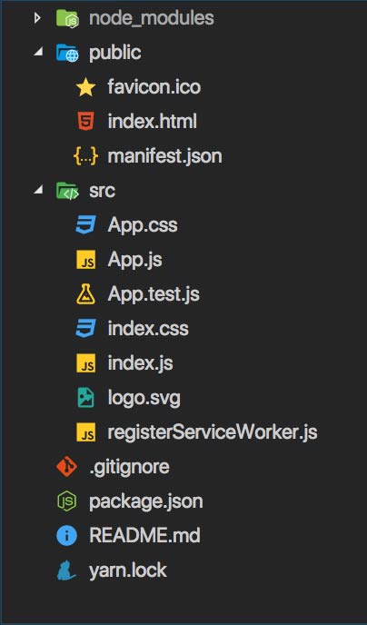

# 2. Entendiendo el proyecto

Durante el workshop 

## Estructura del proyecto

lo primero que vamos a hacer es crear un nuevo proyecto y lo haremos de la siguiente manera:

1. Primero crearemos el proyecto y haremos correr
```
create-react-app my-app
cd my-app
npm start
yarn start
```

1. Abrir la carpeta con _VS Code_ o la herramienta que prefiera para ver la estructura de archivos.

    

    _Estructura de la carpeta del proyecto_

1. Para recorrer el proyecto, vamos a arrancar abriendo el archivo _package.json_. Éste archivo es típico de un proyecto hecho en _node.js_ y contiene las dependencias e información del mismo.

1. Notar que en el nodo `scripts`, está configurado el llamado _start_ para hacer correr el servidor local
    ```json
    "scripts": {
        "start": "react-scripts start",
        "build": "react-scripts build",
        "test": "react-scripts test --env=jsdom",
        "eject": "react-scripts eject"
    },
    ```

1. Ahora, abrir el archivo _index.js_. Éste contiene el código para insertar el componente principal App.js

1. Primero veremos las importaciones del proyecto.

    ```
    import React, { Component } from 'react';
    import logo from './logo.svg';
    import './App.css';
    ```

    > **Nota**: donde la mas importante es React.

1. Luego veremos el componente principal.

    ```
    class App extends Component {
        render() {
            return (
            <div className="App">
                ...
            </div>
            );
        }
    }
    ```

     > **Nota**: Ahora vemos una clase en javascript que extiende de Component un metodo propio es render que retorna el componente que sera el que se muestre.

1. ahora haremos las siguientes cosas:
    
    - crear una nueva carpeta `components`.
    - dentro la carpeta crear un nuevo archivo `HelloWord.js`
    - y copiaremos el siguiente texto

```
import React, { Component } from 'react'

class HelloWord extends Component {
  render() {
    return (
      <p>Hola {this.props.message}</p>
    );
  }
}

export default HelloWord```

## Próximo modulo
Avanzar al [módulo 3](../03-conceptos)